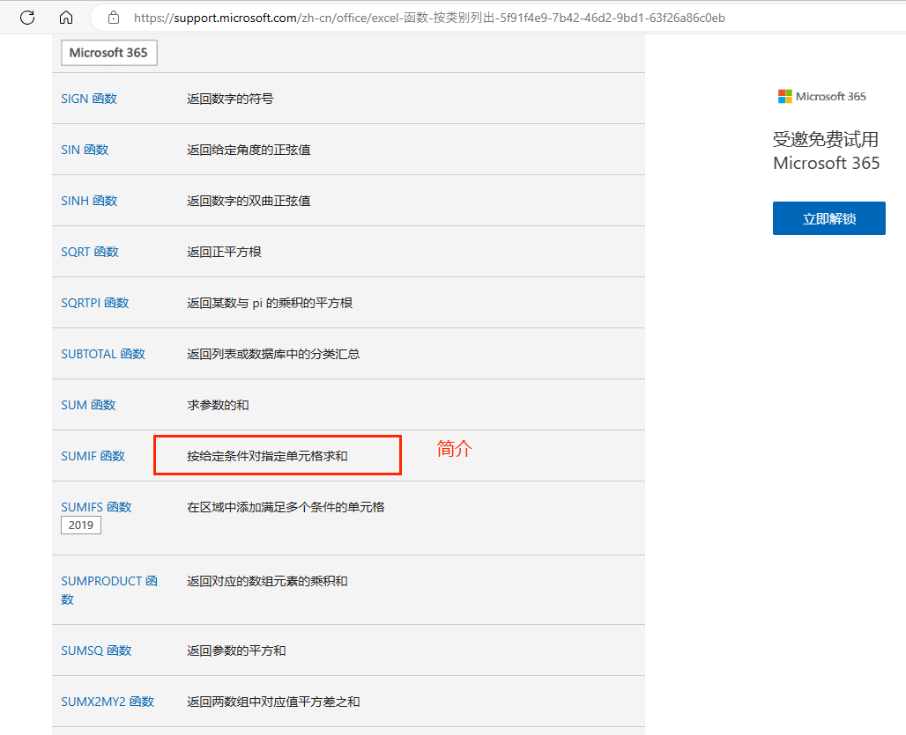
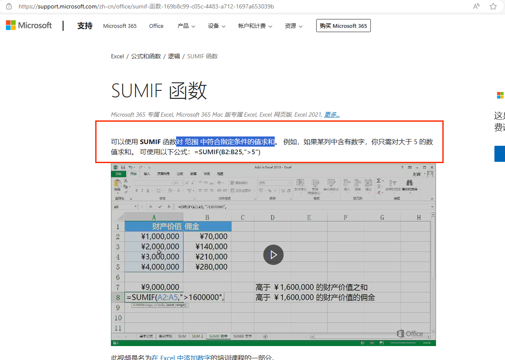

`@univerjs/sheets-formula` 提供了在电子表格中编辑公式的能力，例如自动补全、公式提示、公式的下拉填充以及复制粘贴等等。

:::note
公式计算是电子表格的核心功能之一，因此公式计算调度是在 `@univerjs/sheets` 中进行的。
:::

## 如何贡献公式

### 参考文档

[Office Excel 函数（按类别列出）](https://support.microsoft.com/zh-cn/office/excel-%E5%87%BD%E6%95%B0-%E6%8C%89%E7%B1%BB%E5%88%AB%E5%88%97%E5%87%BA-5f91f4e9-7b42-46d2-9bd1-63f26a86c0eb)

### 类别

- Financial
- Date
- Math
- Statistical
- Lookup
- Database
- Text
- Logical
- Information
- Engineering
- Cube
- Compatibility
- Web
- Array
- Univer

### 前置条件

先参考我们的[贡献指南](https://github.com/dream-num/univer/blob/dev/CONTRIBUTING.md)运行 Univer 项目，再开始贡献公式。

### 要求

要实现一个公式，需要添加公式描述、国际化和公式算法，以 `SUMIF` 函数的写法为例作为参考

1. 添加函数名称  
    
    位置在 [packages/engine-formula/src/functions/math/function-names.ts](https://github.com/dream-num/univer/blob/dev/packages/engine-formula/src/functions/math/function-names.ts)。
    
    每个分类都有一个文件夹，包含一个 `function-names` 文件用于统一管理这个分类的所有函数名。我们先添加上函数名称，在 `sheets-formula` 插件中会用到。
    
    注意，Excel 中一个函数可能属于多个分类，比如 `FLOOR` 在兼容性和数学函数中出现，我们将它归类到数学分类下。其他函数也是这样处理，以确切的分类为依据。

    > 大多数 Excel 函数已经写好了函数名。新的函数可以在末尾添加

2. 国际化文件  
    
    位置在 [packages/sheets-formula/src/locale/function-list/math/en-US.ts](https://github.com/dream-num/univer/blob/dev/packages/sheets-formula/src/locale/function-list/math/en-US.ts)。
    
    国际化也是一个分类一个文件。简介从 Office 函数分类页参考。
    
    
    函数描述和参数描述从 Office 函数详情页参考
    

    大部分的函数名称我们已经写好了基础的描述、简介、链接、参数结构，推荐您在此基础上进行修改，如果没有的函数需要自己加在末尾。

    要求：
    - 函数翻译的参数 `key` 使用这个函数的每个参数英文名称，比如 `SUMIF`，除非有错误，一般不用改动
    - `description` 参数需要综合下内容进行提取，因为有的 Excel 描述很长，需要简化
    - `abstract` 和 `links` 基本上不需要做改动
    - `aliasFunctionName` 是可选参数，大部分公式不需要填写（也可以只设置某个国家的别名），暂时还未找到有公式别名文档来参考。目前找到一个函数翻译插件可能提供类似功能 [Excel 函数翻译工具](https://support.microsoft.com/zh-cn/office/excel-%E5%87%BD%E6%95%B0%E7%BF%BB%E8%AF%91%E5%B7%A5%E5%85%B7-f262d0c0-991c-485b-89b6-32cc8d326889)
    - `functionParameter` 中需要为每个参数设定一个名称，我们推荐根据参数的含义进行变化，比如数值类型的 `key` 为 `number`（仅有一个数值参数的时候）或者 `number1`、`number2`（有多个数值参数的时候），范围为 `range`，条件为 `criteria`，求和范围为 `sum_range`（多个单词之间用 `_` 分割）
    - Office 函数文档中文翻译猜测用的机翻，部分翻译不容易理解，需要自己修改，一部分专用名词如下。
        + 单元格参考 => 单元格引用
        + 数字类型的参数统一翻译为：数值
    - `abstract` 结尾不要加句号（用在用户输入单元格时的搜索列表中，但是部分国家的语言有加句号的习惯，比如日本语，参照 Excel 的简介信息即可），`description` 和 `detail` 结尾加句号（用在描述中）
    - 英文句子的首字母大写
    - 注意所有的现有的国际化文件都需要填写，目前只有中英日（Excel 介绍页底部可以切换语言）

3. 公式描述
    
    `SUMIF` 属于 `math` 分类，描述信息在 [packages/sheets-formula/src/services/function-list/math.ts](https://github.com/dream-num/univer/blob/dev/packages/sheets-formula/src/services/function-list/math.ts)，这个文件负责整个 `math` 分类所有函数。

    要求：
    - 在 `FUNCTION_LIST_MATH` 数组中增加公式，我们建议保持和国际化文件中的顺序一致，便于管理和查找
    - `functionName` 需要引用之前定义的 `FUNCTION_NAMES_MATH` 枚举
    - `aliasFunctionName` 也是可选的，如果国际化文件中没有别名，这里也不用添加
    - 国际化字段注意对应好函数名和参数名
    - 注意修改函数参数的信息， `example` 参数示例（比如范围写 `"A1:A20"`，条件写 `">5"` ），`require` 是否必需（1 必需，0 可选） ，`repeat` 是否允许重复（1 允许重复，0 不允许重复），详细说明参考文件内的接口 [IFunctionParam](https://github.com/dream-num/univer/blob/dev/packages/engine-formula/src/basics/function.ts)

4. 公式算法

    位置在 [packages/engine-formula/src/functions/math/sumif/index.ts](https://github.com/dream-num/univer/blob/dev/packages/engine-formula/src/functions/math/sumif/index.ts)。

    在当前公式的分类文件夹下新建公式文件夹，一个公式一个文件夹。然后新建 `index.ts` 文件来写公式算法，公式 `class` 的名称采用大驼峰的写法，认为公式是一个单词，带 `_` 或者 `.` 的公式认为是两个单词，比如
    
    - `SUMIF` => `Sumif`
    - `NETWORKDAYS.INTL` => `Networkdays_Intl`
    - `ARRAY_CONSTRAIN` => `Array_Constrain`

    同级新建 `__tests__` 来写编写单元测试。写完之后，记得在分类目录下的 `function-map` 文件中添加公式算法和函数名映射用于注册这个函数算法。

    位置在 [packages/engine-formula/src/functions/math/function-map.ts](https://github.com/dream-num/univer/blob/dev/packages/engine-formula/src/functions/math/function-map.ts)。

5. 单元测试

    位置在 [packages/engine-formula/src/functions/math/sumif/\_\_tests\_\_/index.spec.ts](https://github.com/dream-num/univer/blob/dev/packages/engine-formula/src/functions/math/sumif/__tests__/index.spec.ts)

    注意：

    - 补充 `sheetData`, 根据公式计算的需要构建好 `cellData`, 确定 `rowCount`、`columnCount`
    - 手动初始化公式 `new Sumif(FUNCTION_NAMES_MATH.SUMIF)`
    - 每个测试中手动构建好公式入参，最后 `calculate` 执行即可
    - 单个公式的测试一般用于当前单个公式的算法，如果需要测试多个公式的嵌套，可以手动嵌套，或者到 `/packages/engine-formula/src/functions/__tests__` 目录下执行嵌套的复杂公式

6. 功能测试

    启动 Univer 开发模式，在界面上测试公式，预先构造好数据，
    - 在任一空白单元格输入 `=sumif`，预期会有搜索提示列表弹出
    - 确认选择 `SUMIF` 或者 输入 `=sumif(` 之后，触发公式详细介绍弹窗，仔细检查介绍页内容是否完整
    - 选择数据范围，确认之后触发计算，检查公式计算结果是否正确

### 公式实现注意事项

- 任何公式的入参和出参都可以是 `A1`、`A1:B10`，调研 Excel 的时候需要把所有情况考虑到，比如 `=SIN(A1:B10)`，会展开一个正弦计算后的范围。
	- 例如 `XLOOKUP` 函数，要求两个入参的行或列至少又一个大小相等，这样才能进行矩阵计算。
	- 例如 `SUMIF` 函数，大家以为是求和，但是它是可以根据第二个参数进行展开的
        
        
    - Excel 的公式计算，越来越像 numpy，比如
        

- 公式的数值计算，需要使用内置的方法，尽量不要获取值自行计算。因为公式的参数可以是值、数组、引用。可以参考已有的 `sum`、`minus` 函数。
- 精度问题，公式引入了 `big.js`，使用内置方法会调用该库，但是相比原生计算会慢接近100倍，所以像 `sin` 等 `js` 方法，尽量用原生实现。
- 需要自定义计算，使用 `product` 函数，适合两个入参的计算，调用 `map` 对值自身进行迭代计算，适合对一个入参本身的值进行改变。

### 公式基础工具

1. `ValueObjectFactory` 用来自动识别参数格式创建一个参数实例，范围类型的数据用 `RangeReferenceObject` 来创建参数实例
2. 数组 `toArrayValueObject` 可以与值直接运算，得到新的数组

