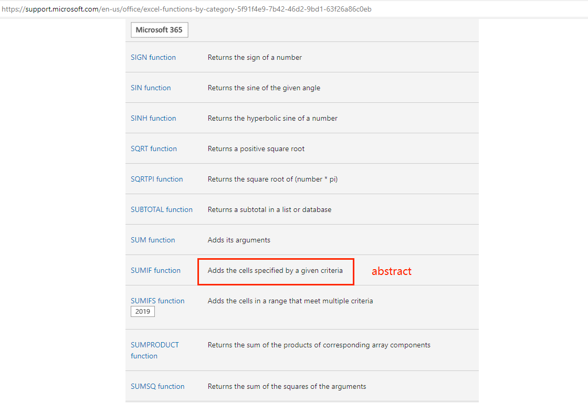
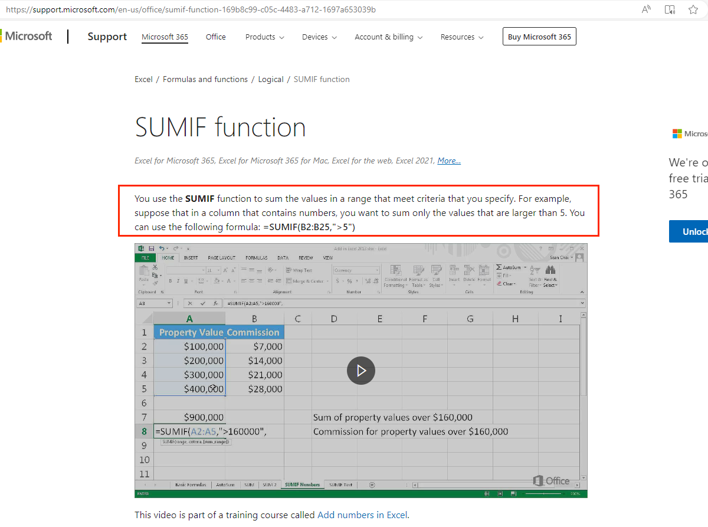
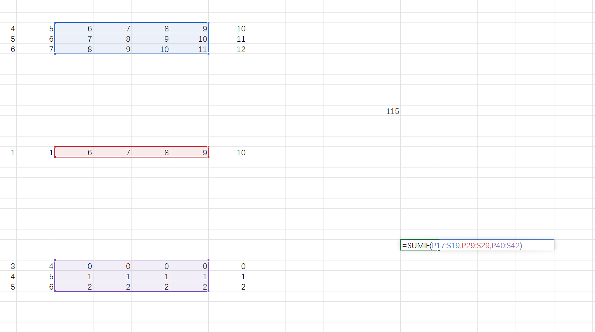
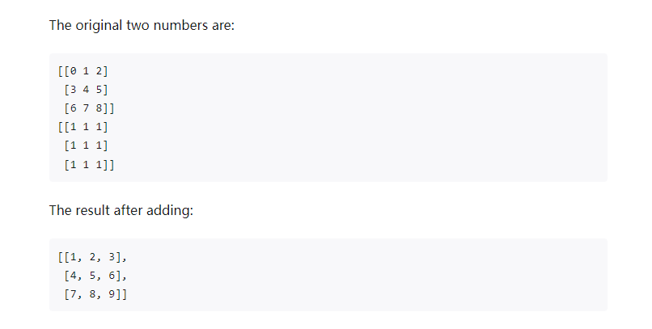

`@univerjs/sheets-formula` provides the ability to edit formulas in spreadsheets, including features such as auto-completion, formula suggestions, drop-down filling for formulas, and copy-paste functionality.

:::note 
Formula calculation is one of the core functionalities of spreadsheets, and formula calculation scheduling is done in `@univerjs/sheets`. 
:::

## How to Contribute Formulas

### Reference Documentation

[Office Excel functions (by category)](https://support.microsoft.com/en-us/office/excel-functions-by-category-5f91f4e9-7b42-46d2-9bd1-63f26a86c0eb)

### Categories

* Financial
* Date
* Math
* Statistical
* Lookup
* Database
* Text
* Logical
* Information
* Engineering
* Cube
* Compatibility
* Web
* Array
* Univer

### Prerequisites

Refer to our [contribution guidelines](https://github.com/dream-num/univer/blob/dev/CONTRIBUTING.md) to set up the Univer project before contributing formulas.

### Requirements

To implement a formula, you need to add formula description, internationalization, and formula algorithm. Take the `SUMIF` function as an example for reference.

1. Add Function Name
    
    Location: [packages/engine-formula/src/functions/math/function-names.ts](https://github.com/dream-num/univer/blob/dev/packages/engine-formula/src/functions/math/function-names.ts).
    
    Each category has a folder containing a `function-names` file to manage all function names in that category. Add the function name, which will be used in the `sheets-formula` plugin.
    
2. Internationalization Files
    
    Location: [packages/sheets-formula/src/locale/function-list/math/en-US.ts](https://github.com/dream-num/univer/blob/dev/packages/sheets-formula/src/locale/function-list/math/en-US.ts).
    
    Internationalization is organized by category, with a file for each category. Refer to the Office function category page for a brief overview. 
    
    
    Refer to the Office function details page for function descriptions and parameter descriptions. 
    
    
    Most function names already have basic description, abstract, links, and parameter structures. It is recommended to modify them based on this foundation. If a function is not present, add it to the end.
    
    Requirements:
    
    * Use the English names of function parameters as the `key` for translation, e.g., `SUMIF`. Generally, do not modify unless there is an error.
    * Extract the `description` from the content, as some Excel descriptions are lengthy and need simplification.
    * `abstract` and `links` generally do not need modification.
    * `aliasFunctionName` is optional; most formulas do not need to be filled (or can be set for aliases in specific countries). Currently, there is no documentation for formula aliases. Currently I have found a function translation plug-in that may provide similar functions [Excel Functions Translator](https://support.microsoft.com/en-us/office/excel-functions-translator-f262d0c0-991c-485b-89b6-32cc8d326889)
    * `functionParameter` needs a name for each parameter. We recommend varying names based on the parameter's meaning, e.g., use `number` for a numeric parameter (if there is only one) or `number1`, `number2` for multiple numeric parameters. Use `range` for a range, `criteria` for conditions, and `sum_range` for the sum range (separated by `_` for multiple words).
    * Some Chinese translations in the Office function documentation are machine-translated and may be unclear. Modify as needed. For example, `单元格参考` (Cell Reference) should be translated as `单元格引用`. Numeric type parameters are uniformly translated as: `数值`.
    * Do not end `abstract` with a period (used in the search list when users input cells), but end `description` and `detail` with a period (used in descriptions).
    * Capitalize the first letter of English sentences.
    * Ensure that all existing internationalization files are filled. Currently, there are only Chinese, English, and Japanese translations (languages can be switched at the bottom of the Excel introduction page).

3. Formula Descriptions
    
    `SUMIF` belongs to the `math` category, and the description is in [packages/sheets-formula/src/services/function-list/math.ts](https://github.com/dream-num/univer/blob/dev/packages/sheets-formula/src/services/function-list/math.ts), which manages all functions in the `math` category.
    
    Requirements:
    
    * Add the formula to the `FUNCTION_LIST_MATH` array. It is recommended to keep the order consistent with the internationalization file for easy management and retrieval.
    * Reference the previously defined `FUNCTION_NAMES_MATH` enum for the `functionName`.
    * `aliasFunctionName` is also optional; if there are no aliases in the internationalization file, you do not need to add them here.
    * Pay attention to the correspondence between internationalization fields and function and parameter names.
    * Modify function parameter information, including the `example` parameter example (e.g., for a range, use `"A1:A20"`; for conditions, use `">5"`), the `require` parameter (1 for required, 0 for optional), and the `repeat` parameter (1 for allowed, 0 for not allowed). For detailed information, refer to the interface [IFunctionParam](https://github.com/dream-num/univer/blob/dev/packages/engine-formula/src/basics/function.ts).

4. Formula Algorithm
    
    Location: [packages/engine-formula/src/functions/math/sumif/index.ts](https://github.com/dream-num/univer/blob/dev/packages/engine-formula/src/functions/math/sumif/index.ts).
    
    Create a new folder for the formula under the current formula category, with one folder per formula. Then create an `index.ts` file to write the formula algorithm. Use camel case for the formula `class` name, considering the formula as one word. If a formula contains `_` or `.`, treat it as two words, such as:
    
    * `SUMIF` => `Sumif`
    * `NETWORKDAYS.INTL` => `Networkdays_Intl`
    * `ARRAY_CONSTRAIN` => `Array_Constrain`
    
    Create a `__tests__` folder at the same level to write unit tests. After writing, remember to add the formula algorithm and function name mapping in the `function-map` file in the category directory to register the formula algorithm.
    
    Location: [packages/engine-formula/src/functions/math/function-map.ts](https://github.com/dream-num/univer/blob/dev/packages/engine-formula/src/functions/math/function-map.ts).
    
5. Unit Tests
    
    Location: [packages/engine-formula/src/functions/math/sumif/\_\_tests\_\_/index.spec.ts](https://github.com/dream-num/univer/blob/dev/packages/engine-formula/src/functions/math/sumif/__tests__/index.spec.ts)
    
    Note:
    
    * Supplement `sheetData` according to the formula's calculation needs, construct `cellData` based on the calculated data, and determine `rowCount` and `columnCount`.
    * Manually initialize the formula with `new Sumif(FUNCTION_NAMES_MATH.SUMIF)`.
    * Manually build the formula parameters for each test, and execute `calculate` at the end.
    * Single formula tests are generally used for testing the algorithm of the current formula. If testing nested formulas with multiple formulas is needed, manually nest them or go to the `/packages/engine-formula/src/functions/__tests__` directory to execute complex nested formulas.

6. Functional Tests
    
    Start Univer in development mode, test formulas on the interface, and preconstruct data.
    
    * In any blank cell, enter `=sumif`. Expect a search prompt list to appear.
    * After selecting `SUMIF` or entering `=sumif(`, trigger the formula details popup and carefully check the contents.
    * Select the data range, trigger the calculation, and check if the formula calculation result is correct.

### Considerations for Formula Implementation

* Any formula's input and output can be `A1`, `A1:B10`, etc. When researching Excel, consider all cases, such as `=SIN(A1:B10)`, which expands to the calculated range.
    * For example, the `XLOOKUP` function requires at least one of the rows or columns of its two inputs to be of equal size for matrix calculation.
    * For example, the `SUMIF` function, although commonly used for summation, can expand based on the second parameter. 
         
        
    * Excel formula calculation is becoming more like numpy, for example: 
        
* For numerical calculations in formulas, use built-in methods and try to avoid obtaining values for manual calculation. Because formula parameters can be values, arrays, or references. You can refer to existing `sum` and `minus` functions.
* Precision issues: The formula introduces `big.js`, and using built-in methods will call this library. However, it is nearly 100 times slower than native calculations. Therefore, for methods like `sin`, it is advisable to use native implementations.
* For custom calculations, use the `product` function, suitable for calculating two input parameters. Call `map` to iterate over the values for changes to a parameter's own values.
    

### Formula Basic Tools

1. `ValueObjectFactory` is used to automatically recognize parameter formats and create a parameter instance. Use `RangeReferenceObject` to create parameter instances for range-type data.
2. The array `toArrayValueObject` can be operated directly with values to get a new array.